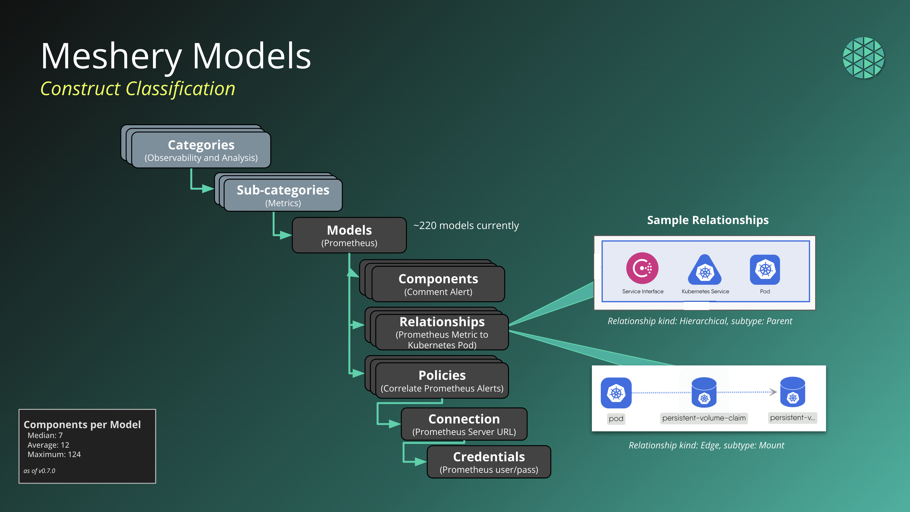

Meshery's internal object model is designed to provide a consistent and extensible way of capturing and characterizing the resources under Meshery's management. Meshery Models serve as an internal model within Meshery, defining constructs and their relationships, and enabling consistent communication between components.

# Key aspects and characteristics

## Design Principles
Meshery Models adheres to several design principles, including establishing a set of constructs, clearly defining construct boundaries, allowing construct extension, reusing existing models, being user-centric, and simplifying complex networking and distributed systems.

### Core Constructs

[Models](https://github.com/meshery/meshery/tree/master/server/meshmodel) introduces various core constructs that form the foundation of the model. Some of the core constructs mentioned in the document include Components, Designs, Patterns, Traits, Metrics, Actions, Color, and Relationships. Models having the same `name` and `version` attributes are considered duplicates.

### Component

[Components](https://github.com/meshery/meshery/tree/master/server/meshmodel/components) represent entities in the Meshery ecosystem, exposing capabilities of the underlying platform. They can be registered, created, and used by users and operators. Components have definitions, instances, and associated metadata. Components having the same `kind`, `apiVersion` and `model.name` attributes are considered duplicates.

### Design

Designs are deployable units in Meshery that describe the desired infrastructure. They consist of components and patterns, allowing users to define and configure the behavior of their cloud-native applications.

### Pattern

Patterns augment the operational behavior of a deployed instance of a design. They define best practices for configuring and operating cloud-native application functionality. Patterns can be applied to components or designs, and they are read-only.

### Trait

Traits provide additional details about a component in Meshery. They offer specific functionality or characteristics associated with a component, enhancing its capabilities. Traits can be attached to components to customize their behavior.

### Metrics, Actions, Color

MeshModel includes constructs for managing metrics, defining actions, and specifying color properties of components or designs. These constructs help in monitoring, controlling, and visualizing different aspects of the Meshery ecosystem.

### Relationships

[Relationships](https://github.com/meshery/meshery/tree/master/server/meshmodel/relationships) define the nature of interaction between interconnected components in MeshModel. They represent various types of connections and dependencies between components, such as hierarchical, network, or default relationships. Relationships have selectors, metadata, and optional parameters.

### Model Packaging

MeshModel supports packaging constructs as OCI-compatible images, making them portable and encapsulating intellectual property. Model packages can include multiple MeshModel constructs, facilitating reusability and versioning.

### Evaluation and Policies

MeshModel provides a model evaluation algorithm to ensure desired behavior enforcement. [Policies](https://github.com/meshery/meshery/tree/master/server/meshmodel/policies) can be applied to components and relationships, defining rules and actions based on predefined conditions.

