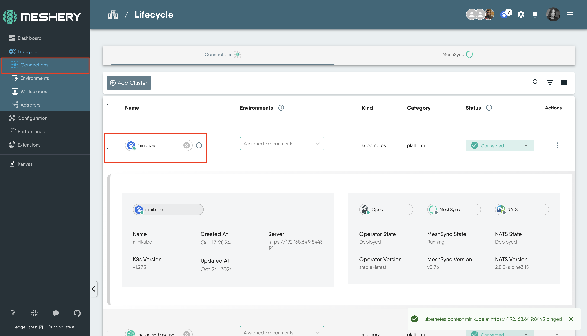

### Introduction

Meshery, a powerful multi-cloud management platform, can be used to deploy and manage AWS resources, like EC2 instances, within a Kubernetes environment by leveraging AWS Controllers for Kubernetes (ACK). This integration allows developers to efficiently manage AWS resources directly from their Kubernetes clusters without the need for command-line tools like kubectl. Instead of using kubectl, Meshery provides `Kanvas`, an intuitive, visual interface that simplifies the deployment process.

Rather than relying on terminal commands, you can connect your Kubernetes cluster to Meshery and use Kanvas to visually configure and deploy resources like EC2 instances. This GUI-based approach makes it easier to visualize your resources, making the deployment process more intuitive and accessible, especially for those who prefer working with visual tools.

AWS Controllers for Kubernetes (ACK) provides a bridge between Kubernetes and AWS services, enabling developers to manage AWS resources directly from within their Kubernetes clusters. This document explores the integration of ACK with Meshery, a powerful multi-cloud management platform that facilitates the deployment and management of AWS resources in a Kubernetes environment.

In this guide, we will walk through the architecture, setup, and workflow required to integrate ACK with Meshery, outlining the key benefits and practical use cases. Specifically, we’ll focus on using Meshery to deploy AWS resources like EC2 instances via the AWS Controllers for Kubernetes, enhancing operational efficiency for cloud-native application deployments.

### Prerequisite

### Table of Content

#### Key Steps in the Process

**1. Connecting Your Kubernetes Cluster to Meshery**
The first step involves connecting your Kubernetes cluster to Meshery, enabling it to interact with AWS through the ACK integration.

**2. Deploying the Necessary Custom Resources**
Using Meshery, you'll deploy essential resources such as VPCs, subnets, and other networking components required for the EC2 instance to function properly within your AWS environment.

**3. Confirming Your Deployment**
After the resources have been deployed, you can verify the EC2 instance through AWS Management Console or Meshery’s visualization mode, which provides a clear, interactive view of the resources.

By the end of this document, you will have a comprehensive understanding of how to leverage ACK and Meshery to enhance the deployment and management of your cloud-native applications on AWS.

### Environment Setup

The first step in this process is connecting your Kubernetes cluster to Meshery. In this guide, we will use Minikube for our setup. It’s important to note that Meshery can be deployed in two ways: `in-cluster` or `out-of-cluster` using the mesheryctl command.

- `In-Cluster Deployment`: In this approach, Meshery is deployed directly within your Kubernetes cluster using Helm in the meshery namespace.

- `Out-of-Cluster Deployment`: Here, Meshery runs on Docker containers, and your Minikube cluster can be connected to the Meshery instance.

For this guide, we will focus on the in-cluster deployment of Meshery. Follow this guide on [Meshery Installation on Minikube](https://docs.meshery.io/installation/kubernetes/minikube) to see how to deploy Meshery in-cluster.

After you connect your cluster to Meshery, navigate to the UI at `localhost:9081` to verify that your cluster is listed. Click on the cluster name to ping it and confirm connectivity.

### Deploy Custom Resource Definitions, Deploy Helm Charts, Deploy 

Next, we have to import the controller helm chart into Meshery and deploy it to the minikube cluster through the Kanvas. To do this:

1. 

