## Deploying WordPress and MySql with Persistent Volumes with Meshery

### Introduction

In this tutorial, we will learn how to deploy a **WordPress site and a MySQL database with Persistent Volumes** using Meshery Playground. Meshery Playground is an interactive and collaborative live cluster environment that simplifies the deployment process and enhances user experience by providing visual tools for managing Kubernetes resources.

> **NOTE:** If this is your first time working with Meshery Playground, consider starting with the [Exploring Kubernetes Pods with Meshery Playground](https://docs.meshery.io/guides/tutorials/kubernetes-pods) tutorial first.

### Prerequisites

- Basic understanding of Kubernetes concepts.
- Access to the _Meshery Playground_. If you don't have an account, sign up at [Meshery Playground](https://play.meshery.io/).

### Lab Scenario

- Import the WordPress and MySQL manifest files into Meshery Playground.

- Create persistent volumes and a secret for the resources using the visual tools provided by Meshery.

- Deploy these resources on the playground.

In this lab, you will import the WordPress and MySQL manifest files into Meshery Playground. You will visualize these Kubernetes resources and create persistent volumes for them using the visual tools provided by Meshery. Finally, you will deploy these resources on the Playground.

### Objective

Learn how to import manifest files, visualize Kubernetes resources, create new resource components, and deploy the application using Meshery Playground.

### Steps

#### Download the Kubernetes Configuration Files

Go ahead and download these yaml files [mysql-deployment.yaml](https://kubernetes.io/examples/application/wordpress/mysql-deployment.yaml) and [wordpress-deployment.yaml](https://kubernetes.io/examples/application/wordpress/wordpress-deployment.yaml)

These YAML files contain the Service definitions, Persistent Volume Claims, and Deployment configurations for the WordPress site and the MySQL database.

#### Access Meshery Playground

1. Log in to the [Meshery Playground](https://meshery.layer5.io/) using your credentials. On successful login, you should be at the dashboard. Press the **X** on the _Where do you want to start?_ popup to close it (if required).

2. Click **Explore** in the Cloud Native Playground tile to navigate to _MeshMap_

#### Import the Files to Meshery Playground

1. In the left sidebar, click on the upward arrow symbol(import icon) to import the designs into Meshery.

2. In the modal that appears:
   - Enter a name for your design in the "Design File Name" field (e.g.`mysql-deployment`).

   - Select `Kubernetes Manifest` from the "Design Type" dropdown menu.

        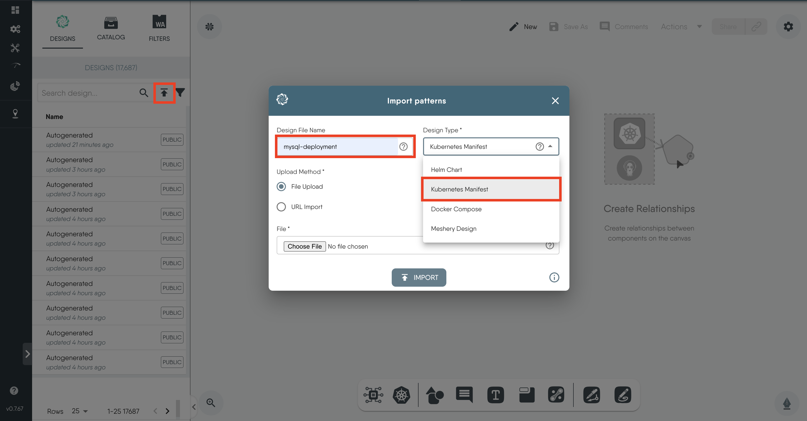

   - Choose `File Upload` for the upload method, and select the file you just downloaded.

   - Then, click on `Import`

        

3. Under the "Designs" tab, you will see that we have successfully imported the `mysql-deployment` design.

   When you click on the names of the designs on the `Designs` tab, you can see the visual representations of the various Kubernetes resources and their relationships on the canvas.

    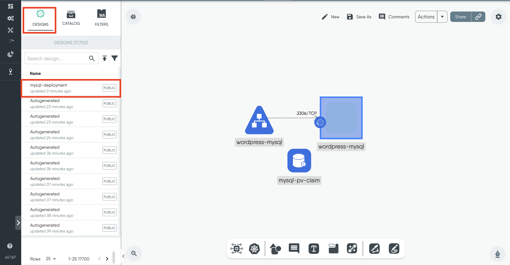

4. Now, follow the same steps to import the `wordpress-deployment` file.

    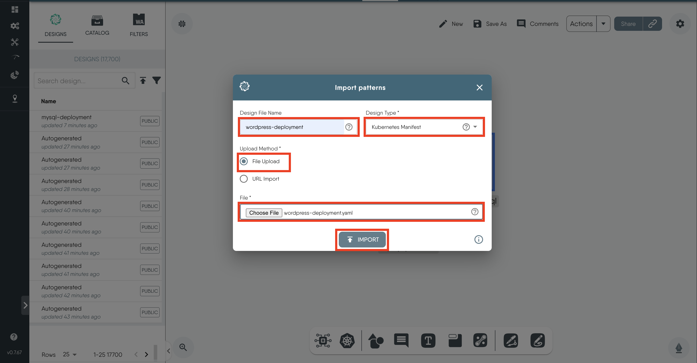

#### Merging the Designs

Next, we will combine the WordPress and MySQL designs into a single design file. By merging these designs, we can manage and deploy both resources together.

To merge the MySQL deployment design with the WordPress deployment design:/
1. Click and drag the `mysql-deployment` design from the left panel and drop it onto the design canvas of the `wordpress-deployment`.

    

2. This action will open a merge modal asking if you want to merge the design, Click on `Merge`.

    

3. Click on `Save As` and enter `wordpress-mysql-deployment` as the new file name.

    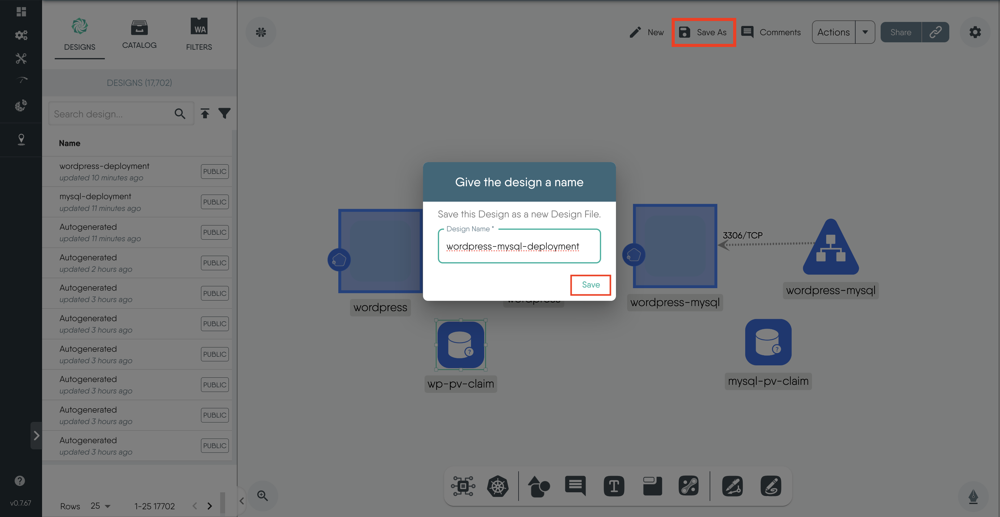

#### Create and Configure Secret for MySQL Database

In this step, we need to create a Kubernetes secret component for the MySQL database. This is necessary because of this configuration in the environment variables section of the mysql-deployment yaml file.

```yaml
env:
- name: MYSQL_ROOT_PASSWORD
  valueFrom:
    secretKeyRef:
      name: mysql-pass
      key: password
```

Before you proceed, choose a password and convert it into base64 format. You can use an online tool for this conversion. For this example the password is `password` and its base64 encoding is `cGFzc3dvcmQ=`

1. Click on the Kubernetes icon on the dock, search for `secret`, and click on it or drag it to the canvas.

    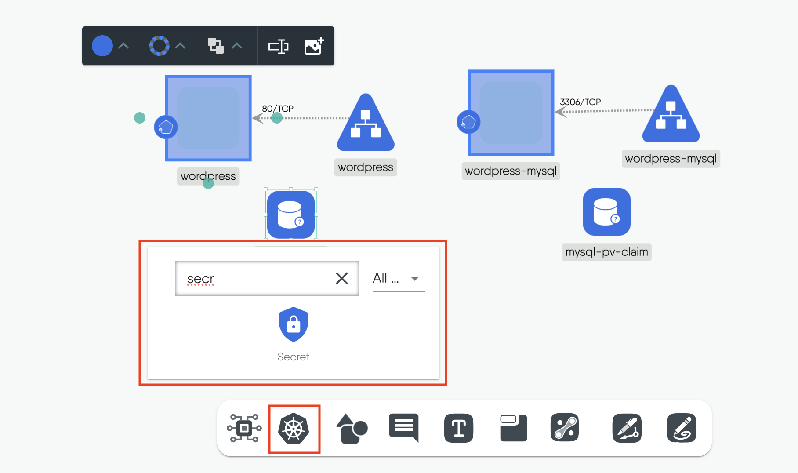

2. Click on the Secret component to open the configuration window.

    - Set the _name_ as `mysql-pass`
    - Set the _Type_ as `Opaque`.
    - Click **+** next to Data and add the secret as a key value pair `password:cGFzc3dvcmQ=`

        

3. Click outside the window to close the configuration tab.

#### Create Persistent Volumes

MySQL and WordPress each require a [Persistent Volume(PV)](https://kubernetes.io/docs/concepts/storage/persistent-volumes/) to store their data.

For this tutorial, we will use the `manual` StorageClassName and set the Persistent Volume to use the `hostPath` type.

Please note that using `hostPath` for Persistent Volumes is generally not recommended for production environments because it ties the volume to the node's filesystem, which can lead to data loss if the node fails. However, we can use it in this tutorial for development purposes.

1. Click on the Kubernetes icon on the dock, search for `Persistent Volume`, and select it. We will create two PV's.

    

2. Click on the wordpress PV to open the configuration window.

    - Change the "name" to `wp-pv`
    - Set the "StorageClassName" as `manual`
    - Click **+** next to "AccessMode" and enter `ReadWriteOnce`

        

    - Scroll down to "Capacity" and enter in the key pair `storage:20Gi`

        

    - Scroll down to "Hostpath" and input `mnt/data/wp-pv` for the _path_ and `DirectoryOrCreate` for the _type_.

        

3. Repeat similar steps for the Mysql Persistent Volume

    - Click on the MySQL PV to open the configuration window.
    - Change the "name" to `mysql-pv`
    - Set the "StorageClassName" to `manual`
    - Click **+** next to "AccessMode" and set it to `ReadWriteOnce`
    - Scroll down to "Capacity", and enter the key pair `storage:20Gi`
    - Scroll down to "Hostpath" and input `mnt/data/mysql-pv` for the _path_ and `DirectoryOrCreate` for the _type_.

4. Click on `wp-pv-claim` and `mysql-pv-claim` and set their "StorageClassName" as `manual`

#### Add Labels

To make it easier to filter and manage our resources during visualization, let's add labels to all of them.

 You can also choose to use the existing label, `app:wordpress`, but a new one, `dev:tutorial`, is recommended for this tutorial to prevent our resources from getting mixed up with others in the public playground cluster.

1. Click on the label icon.
2. Click the **+** sign next to Labels.
3. Add the label `dev:tutorial`.
4. Do this for **all** the resources on the canvas.

    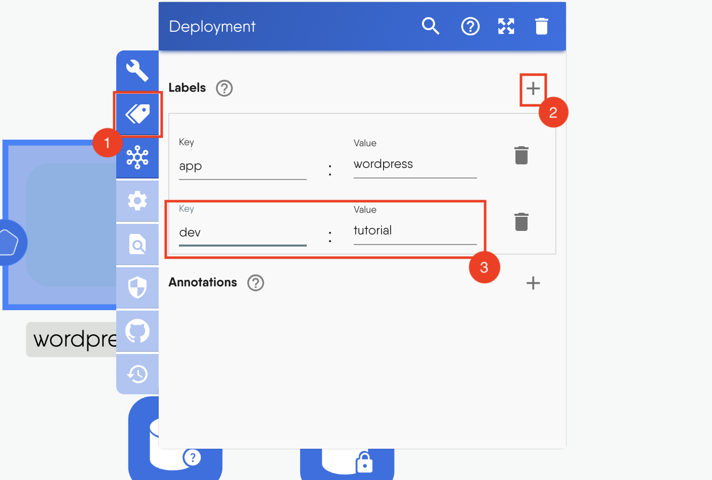

5. Now click on `Save As` and save the design.

#### Group Components

The _**Group Components**_ icon on the dock below allows you to group resources based on shared labels or annotations.

This functionality aids in visualizing the relationships between various resources, making it easier to manage them, troubleshoot issues, and understand the overall cluster architecture.

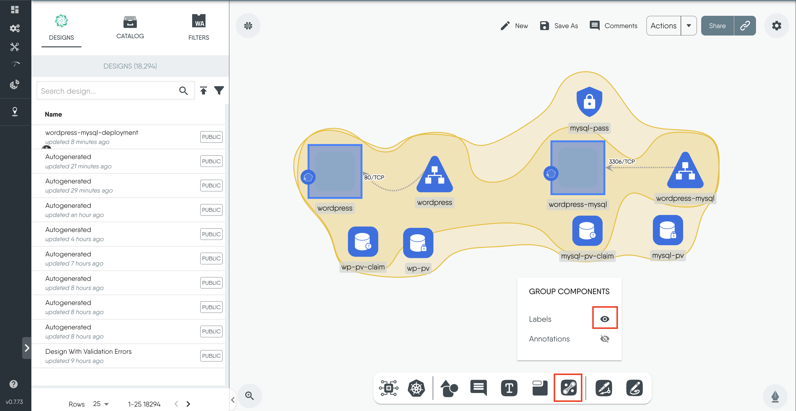

#### Deploy the Resources

1. Click `Actions` in the top right corner and click on `Deploy`.

    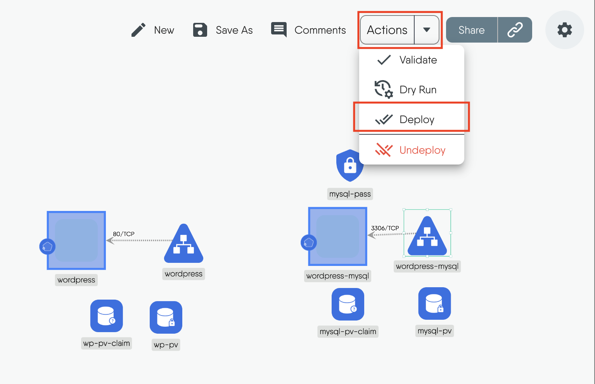

2. The design will be validated to make sure there are no errors.

    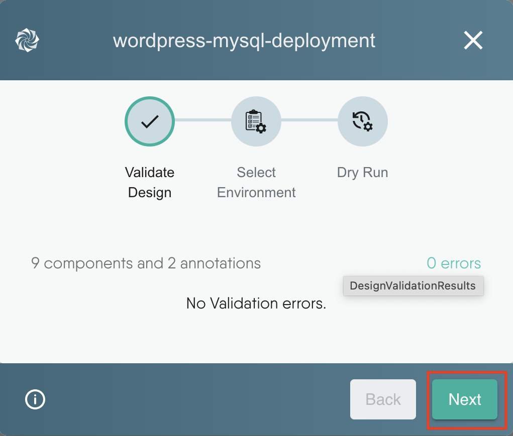

3. Choose the Kubernetes cluster you want to deploy to.

    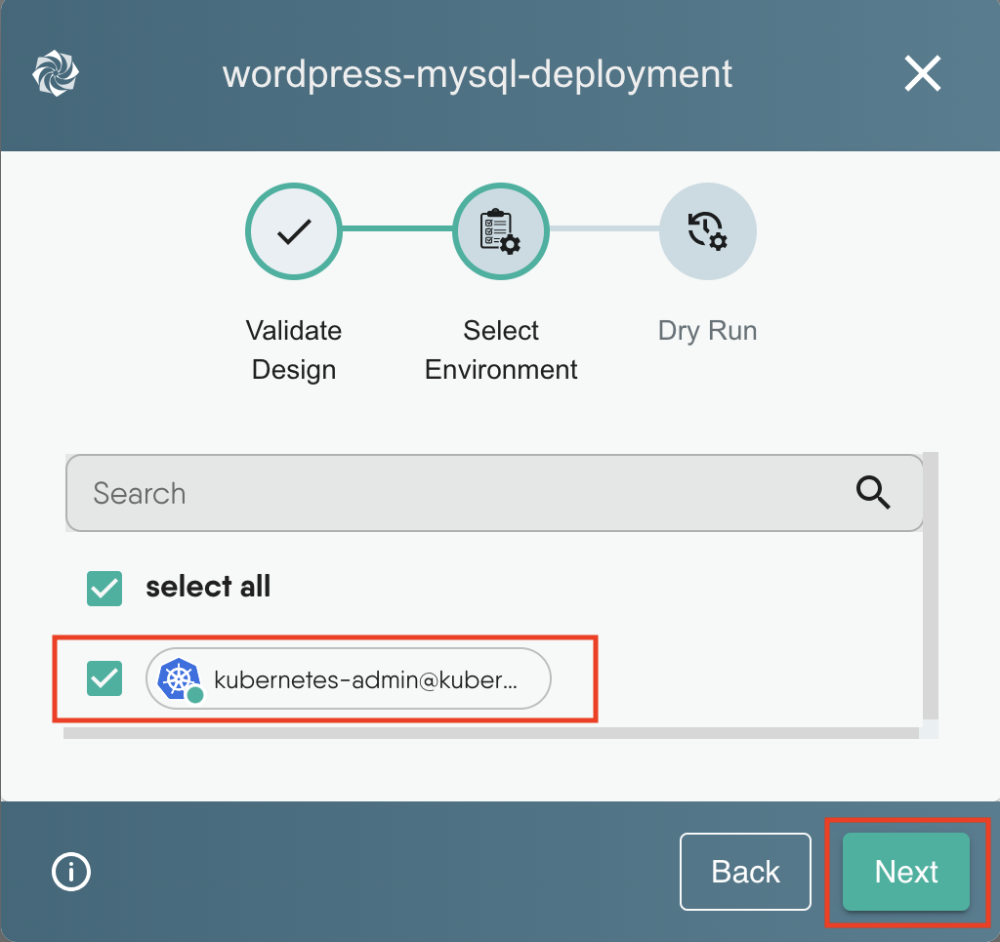

    **_Note_**: The Meshery Playground is connected to live Kubernetes cluster(s) and allows users full control over these clusters but you can also have the option to add your own Kubernetes cluster to the Playground.

4. Finally click `Deploy` to deploy the application to the cluster.

    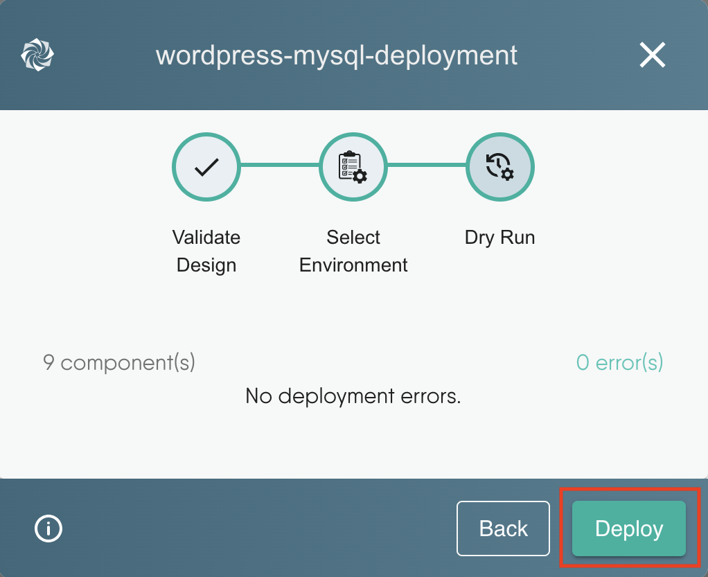

5. To check the status of your deployment, click on the notification icon on the top right corner. You can click on `Open In visualizer` to navigate to the Visualize section or follow the steps below.

    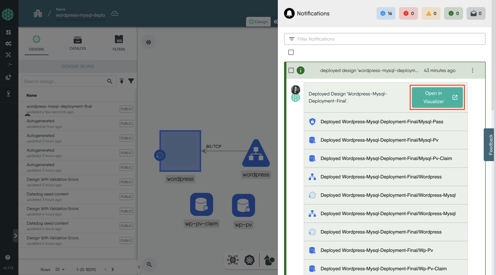


#### Visualizing the Deployed Resources

To view the resources deployed we will use the Visualize section of the _MeshMap_. In this section, you can apply filters to display the specific resources you want to see.

1. Move to the Visualize tab.
2. Click the filter icon and choose the appropriate filters

    - For "Kinds" select `Deployment`, `Service`, `PersistentVolume`, `PersistentVolumeClaim` and `Secret`
    - For the "label" select `dev=tutorial`

3. You can also use the icons on the right sidebar to filter the resources.

    After selecting your filters, you should see a view displaying only your relevant resources, as shown in the image below.

    

#### Resource Details

You can click on any resource to view more details about it in the "Details" section on the right sidebar.

**Deployment**


**Service**

The Service details only display the cluster IP for now. So there is no means for us to access the application externally.


#### Deleting Resources

To delete the resources, use the `Undeploy` option from the Action dropdown in the _Design_ tab.

#### Conclusion

Congratulations! You’ve successfully completed the tutorial on deploying a WordPress site and MySQL database with Persistent Volumes using Meshery Playground. This hands-on experience should have given you valuable insights into importing manifest files, visualizing resources, creating persistent volumes, and managing deployments in Meshery Playground.
